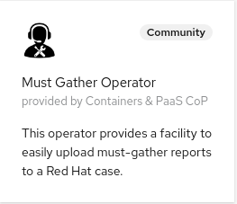

# Must Gather Operator


[](https://goreportcard.com/report/github.com/redhat-cop/must-gather-operator)


The must gather operator helps collecting must gather information on a cluster and uploading it to a case.
To use the operator a cluster administrator can create the following must gather CR:

```yaml
apiVersion: redhatcop.redhat.io/v1alpha1
kind: MustGather
metadata:
  name: example-mustgather
spec:
  caseID: '02527285'
  caseManagementAccountSecretRef:
    name: case-management-creds
```

this request will collect the standard must gather info and upload it to case `#02527285` using the credentials found in the `caseManagementCreds` secret.

A more complex example:

```yaml
apiVersion: redhatcop.redhat.io/v1alpha1
kind: MustGather
metadata:
  name: full-mustgather
spec:
  caseID: '02527285'
  caseManagementAccountSecretRef:
    name: case-management-creds
  serviceAccountRef:
    name: must-gather-admin
  mustGatherImages:
  - quay.io/kubevirt/must-gather:latest
  - quay.io/ocs-dev/ocs-must-gather
```

in this example we are using a specific service account (which must have cluster admin permissions as per must-gather requirements) and we are specifying a couple of additional must gather images to be run for the `kubevirt` and `ocs` subsystem. If not specified serviceAccountRef.Name will default to `default`. Also the standard must gather image: `quay.io/openshift/origin-must-gather:latest` is always added by default.

## Proxy Support

The MustGather operator supports using a proxy. The proxy setting can be specified in the MustGather object. If not specified, the cluster default proxy setting will be used. Here is an example:

```yaml
apiVersion: redhatcop.redhat.io/v1alpha1
kind: MustGather
metadata:
  name: example-mustgather
spec:
  caseID: '02527285'
  caseManagementAccountSecretRef:
    name: case-management-creds
  proxyConfig:
    http_proxy: http://myproxy
    https_proxy: https://my_http_proxy
    no_proxy: master-api  
```

## Garbage collection

MustGather instances are cleaned up by the Must Gather operator about 6 hours after completion, regardless of whether they were successful.
This is a way to prevent the accumulation of unwanted MustGather resources and their corresponding job resources.

## Deploying the Operator

This is a cluster-level operator that you can deploy in any namespace, `must-gather-operator` is recommended.

It is recommended to deploy this operator via [`OperatorHub`](https://operatorhub.io/), but you can also deploy it using [`Helm`](https://helm.sh/).

### Deploying from OperatorHub

If you want to utilize the Operator Lifecycle Manager (OLM) to install this operator, you can do so in two ways: from the UI or the CLI.

#### Deploying from OperatorHub UI

* If you would like to launch this operator from the UI, you'll need to navigate to the OperatorHub tab in the console.Before starting, make sure you've created the namespace that you want to install this operator to with the following:

```shell
oc new-project must-gather-operator
```

* Once there, you can search for this operator by name: `keepalived`. This will then return an item for our operator and you can select it to get started. Once you've arrived here, you'll be presented with an option to install, which will begin the process.
* After clicking the install button, you can then select the namespace that you would like to install this to as well as the installation strategy you would like to proceed with (`Automatic` or `Manual`).
* Once you've made your selection, you can select `Subscribe` and the installation will begin. After a few moments you can go ahead and check your namespace and you should see the operator running.



#### Deploying from OperatorHub using CLI

If you'd like to launch this operator from the command line, you can use the manifests contained in this repository by running the following:

```shell
oc new-project must-gather-operator
oc apply -f config/operatorhub -n must-gather-operator
```

This will create the appropriate OperatorGroup and Subscription and will trigger OLM to launch the operator in the specified namespace.

### Deploying with Helm

Here are the instructions to install the latest release with Helm.

```shell
oc new-project must-gather-operator
helm repo add must-gather-operator https://redhat-cop.github.io/must-gather-operator
helm repo update
helm install must-gather-operator must-gather-operator/must-gather-operator
```

This can later be updated with the following commands:

```shell
helm repo update
helm upgrade must-gather-operator must-gather-operator/must-gather-operator
```

## Development

### Running the operator locally

```shell
make install
export repo=raffaelespazzoli #replace with yours
docker login quay.io/$repo/must-gather-operator
make docker-build IMG=quay.io/$repo/must-gather-operator:latest
make docker-push IMG=quay.io/$repo/must-gather-operator:latest
oc new-project must-gather-operator-local
kustomize build ./config/local-development | oc apply -f - -n must-gather-operator-local
export DEFAULT_MUST_GATHER_IMAGE='quay.io/openshift/origin-must-gather:4.6'
export JOB_TEMPLATE_FILE_NAME=./config/templates/job.template.yaml
export token=$(oc serviceaccounts get-token 'default' -n must-gather-operator-local)
oc login --token ${token}
make run ENABLE_WEBHOOKS=false
```

### Building/Pushing the operator image

```shell
export repo=raffaelespazzoli #replace with yours
docker login quay.io/$repo/must-gather-operator
make docker-build IMG=quay.io/$repo/must-gather-operator:latest
make docker-push IMG=quay.io/$repo/must-gather-operator:latest
```

### Deploy to OLM via bundle

```shell
make manifests
make bundle IMG=quay.io/$repo/must-gather-operator:latest
operator-sdk bundle validate ./bundle --select-optional name=operatorhub
make bundle-build BUNDLE_IMG=quay.io/$repo/must-gather-operator-bundle:latest
docker login quay.io/$repo/must-gather-operator-bundle
podman push quay.io/$repo/must-gather-operator-bundle:latest
operator-sdk bundle validate quay.io/$repo/must-gather-operator-bundle:latest --select-optional name=operatorhub
oc new-project must-gather-operator
operator-sdk cleanup must-gather-operator -n must-gather-operator
operator-sdk run bundle --install-mode AllNamespaces -n must-gather-operator quay.io/$repo/must-gather-operator-bundle:latest
```

### Releasing

```shell
git tag -a "<tagname>" -m "<commit message>"
git push upstream <tagname>
```

If you need to remove a release:

```shell
git tag -d <tagname>
git push upstream --delete <tagname>
```

If you need to "move" a release to the current main

```shell
git tag -f <tagname>
git push upstream -f <tagname>
```

### Cleaning up

```shell
operator-sdk cleanup must-gather-operator -n must-gather-operator
oc delete operatorgroup operator-sdk-og
oc delete catalogsource must-gather-operator-catalog
```
